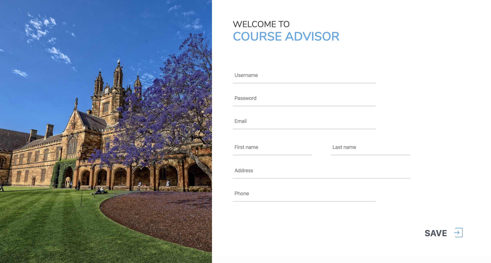
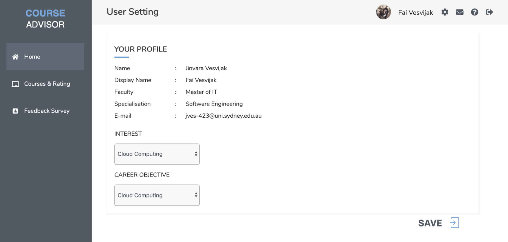
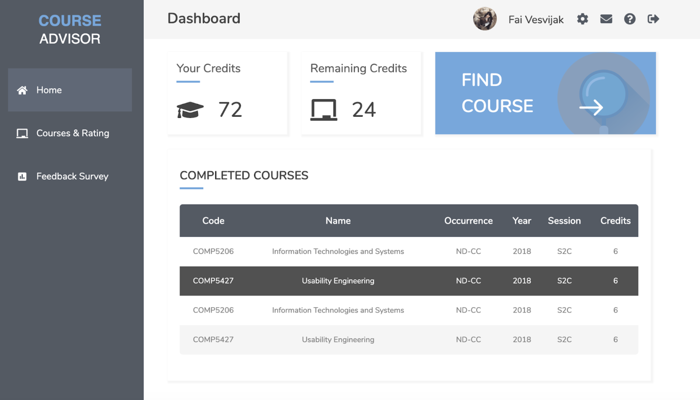
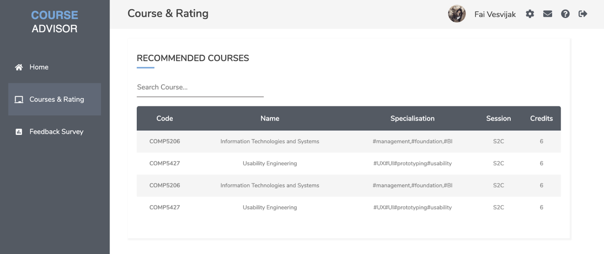
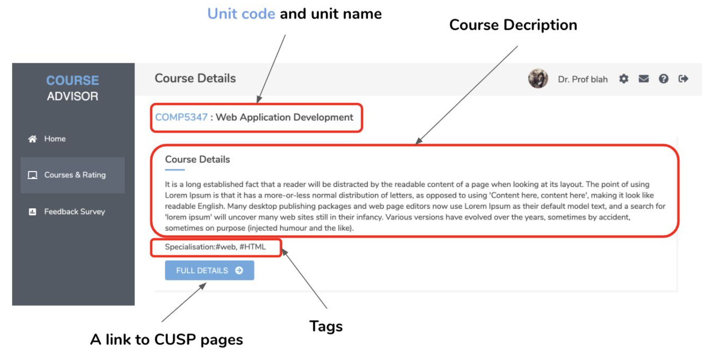
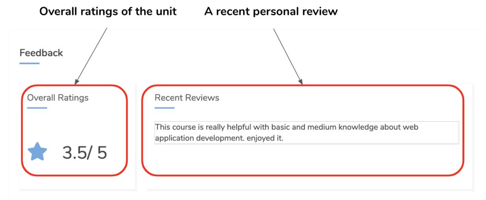
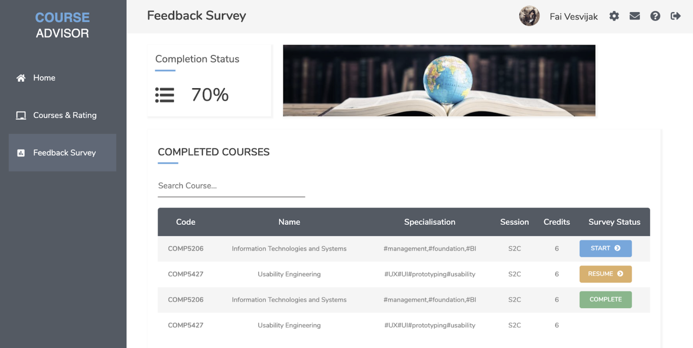
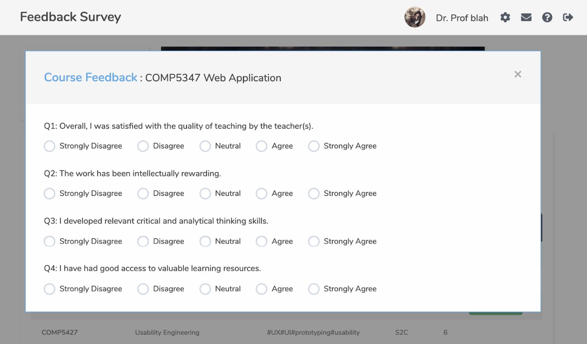
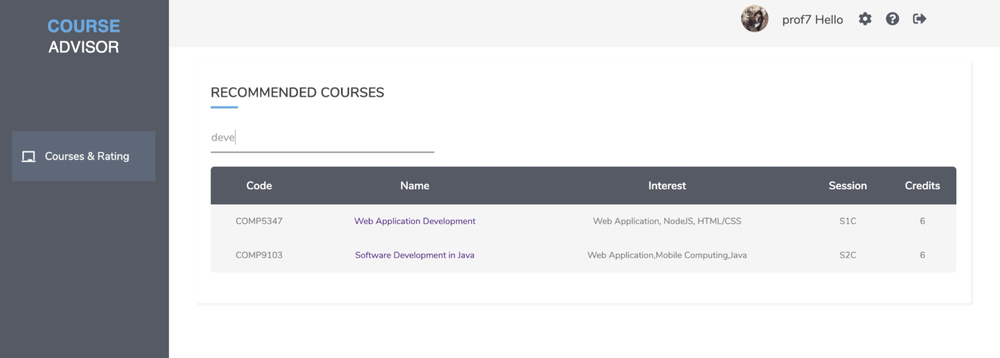

# Course Advisor

Course Advisor is a web portal for the students from the school of IT at the University of Sydney who needs guidance in selecting units of study during their course enrolment every semester. The project vision is to provide swift and beneficial guidance to students in unit selection anywhere and anytime without squandering time for appointments, session and travelling.

## Features

* Recommend courses based on interests and specialisation
* User Account and Settings
* Different Role Access Control for Students and Faculty Members
* Search courses
* View course details, ratings, and feedbacks

(Only for Student)
* View completed credits, remaining credits, and completed courses
* Track status of feedback survey completion
* Able to take feedback for courses taken

### Login and Registration

<p align="center"></p>
<p align="center"></p>

For initial login, user has to set their interest and career objective
<p align="center"></p>

User can change their settings later in the User Setting page
<p align="center"></p>

### Dashboard (For student only)

<p align="center"></p>

### Courses & Ratings
Courses shown are recommended courses for users based on their interests and specilisation configured in the user setting
<p align="center"></p>

Course detail page
<p align="center"> </p>

### Feedback Survey (For student only)
View feedback survey completion status
<p align="center"></p>

Take survey questions
<p align="center"></p>

### Access for Faculty Members
Faculty members account can only access to Courses & Ratings module.
<p align="center"></p>

## Prerequisites
The following applications must be available on the Operating PC to run this project.

* Eclipse JEE with Maven plugin
* http://www.oracle.com/technetwork/java/javase/downloads/index.html[JDK 8] or later
* Apache Tomcat v8.5 or later
* MySQL Workbench Version Build 8.0.18

## Installation

1. Clone or download this repository
2. Install and configure Tomcat server on Eclipse IDE
3. Import project to Eclipse as `courseAdvisor`
4. Right click on the project name `courseAdvisor`, in `ProjectExplorer -> Properties -> TargetRuntime -> New -> Apache Tomcat V9.0 -> Finish`

## Configuration

* Configure the Maven Plugin on Eclipse IDE (in case, it's unavailable)
`Click Help -> Install New Software...-> Add Repository -> Set Name as "M2E Eclipse" and Location as "http://download.eclipse.org/technology/m2e/releases"`

* Configure the mySQL WorkBench database with default ID as `root` and Password as `3102`. Default host is `localhost:3306`

* To setup the database, run SQL commands located in `/courseAdvisor/src/main/resources/au.usyd/sql/ddl.sql`

* Configure the localHost of the Server as port `8080`

## Run application
To run the application:
```
Right click on project name courseAdvisor -> Run As -> Run on Server
```

URL to start the Project : http://localhost:8080/courseAdvisor/
